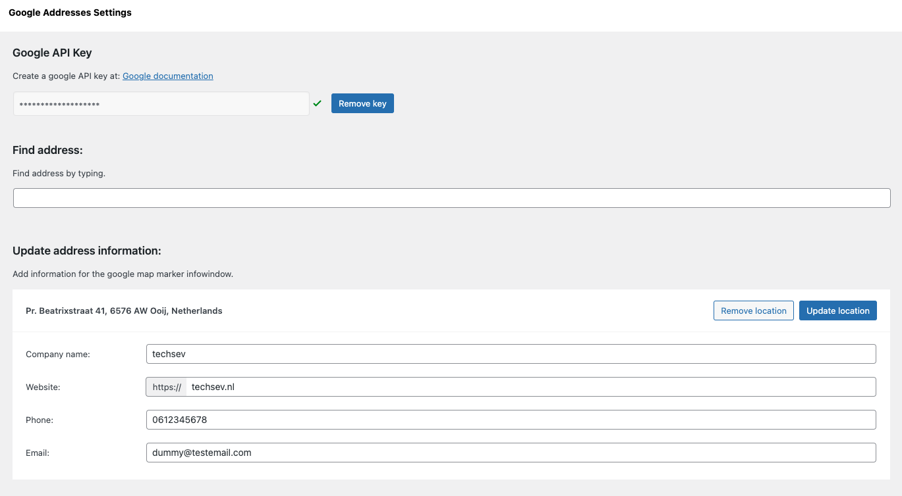

# GAM
Save location name and location lat / lon  
Saved locations are served on /wp-json/gam-addresses/v1/adresses/ 

### Todo
- [x] Save google API key to database
- [x] Save lat / lng coordinates to database using plugin settings page
- [x] Show list of selected locations
- [x] Add option to remove selected locations
- [x] Search Google maps api on typing and copy paste
- [x] Serve lat / lon coordinates in WP Rest API ( to use in React )
- [x] If company name add using PlacesService
- [x] Add custom fields for googlemaps infowindow on location markers
- [ ] If i have time, create front end google maps that loads all picked locations (now you need to use REST api or Options API)